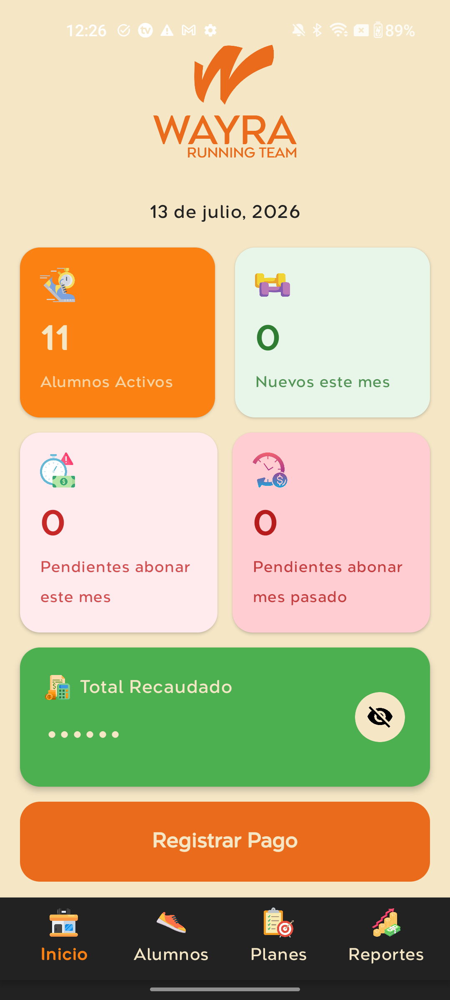
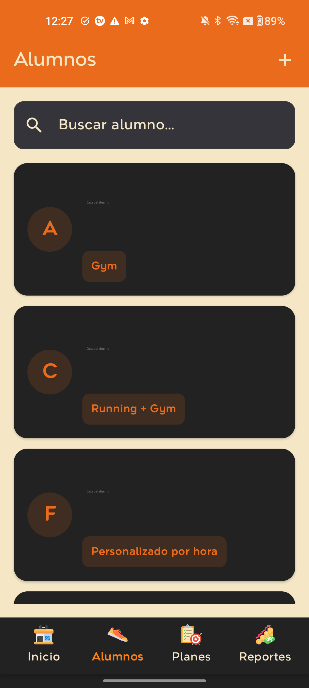
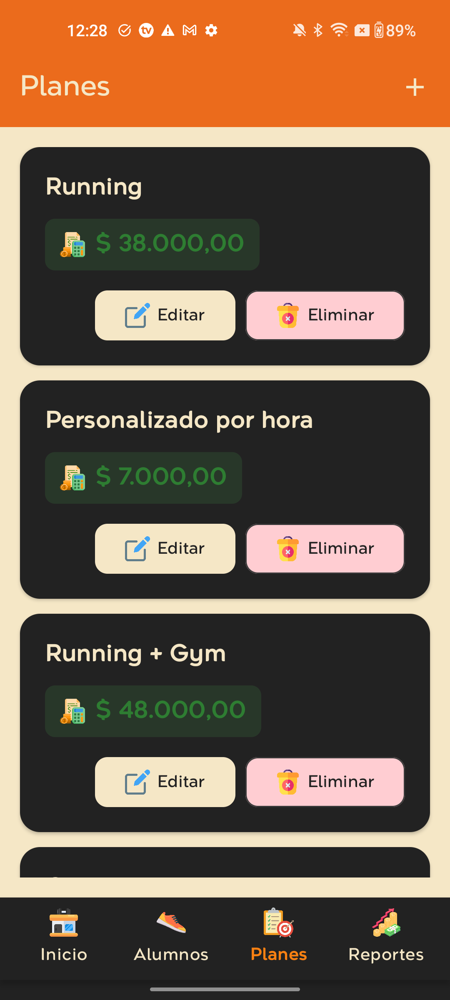
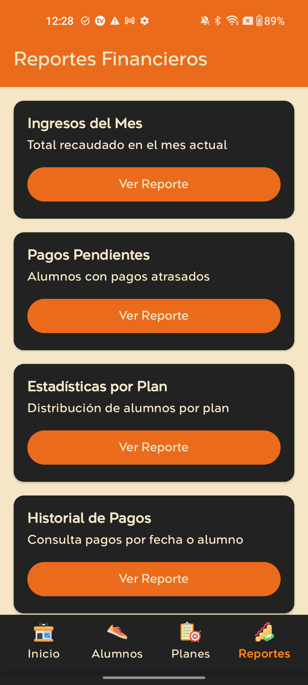

# Wayra 🏃

Wayra es una aplicación Android nativa para la gestión integral de centros de actividades (academias, gimnasios, estudios de entrenamiento). Permite administrar alumnos, planes, suscripciones y pagos de forma simple, rápida y desde el celular, sin depender de planillas.

## Capturas de pantalla

| Inicio | Alumnos | Planes | Reportes |
|---|---|---|---|
|  |  |  |  |

## Funcionalidades

- **Dashboard**: panel de inicio con métricas clave en tiempo real (alumnos activos, altas del mes, pagos pendientes del mes actual y del mes anterior, total recaudado).
- **Gestión de alumnos**: alta, edición, baja y búsqueda de alumnos, con datos de contacto y plan asignado.
- **Planes y suscripciones**: creación y edición de planes personalizados (por ejemplo Running, Gym, Running + Gym, personalizado por hora) con su precio, y vinculación de cada alumno a un plan.
- **Registro de pagos**: control de pagos realizados, pendientes y vencidos por alumno y por mes.
- **Reportes financieros**: ingresos del mes, pagos pendientes, estadísticas de distribución de alumnos por plan e historial de pagos por fecha o alumno.
- **Notificaciones**: alertas de vencimientos y pagos pendientes.
- **Autenticación** de usuarios y monitoreo de errores en producción con Firebase Crashlytics.

## Tecnologías

- **Lenguaje**: Kotlin
- **UI**: Jetpack Compose + Material 3
- **Arquitectura**: MVVM (ViewModel + LiveData), Navigation Compose
- **Backend / servicios**: Firebase (Authentication, Cloud Firestore, Storage, Analytics, Crashlytics)
- **Build**: Gradle (Kotlin DSL)

## Estructura del proyecto

```
Wayra/
├── app/
│   └── src/main/java/com/app/wayra/
│       ├── data/
│       │   ├── model/          # Modelos de datos (Alumno, Plan, Pago, etc.)
│       │   └── repository/     # Acceso a datos / Firestore
│       ├── navigation/         # Navegación entre pantallas (Navigation Compose)
│       └── ui/
│           ├── dashboard/      # Pantalla de inicio y métricas
│           ├── students/       # Gestión de alumnos
│           ├── plans/          # Gestión de planes
│           ├── subscriptions/  # Suscripciones
│           ├── payments/       # Registro de pagos
│           ├── reports/        # Reportes financieros
│           ├── notifications/  # Notificaciones
│           ├── splash/         # Splash screen
│           ├── components/     # Componentes reutilizables de UI
│           └── theme/          # Colores, tipografía y tema de la app
├── dataconnect/                 # Configuración de Firebase Data Connect
├── functions/                    # Firebase Cloud Functions
└── firestore.rules, firestore.indexes.json, firebase.json
```

## Requisitos

- Android Studio (Ladybug o superior recomendado)
- JDK 17+ (se recomienda usar el JBR incluido en Android Studio)
- Un proyecto de Firebase propio, con el archivo `google-services.json` colocado en `Wayra/app/`
- Dispositivo físico o emulador con Android 7.0 (API 24) o superior

## Instalación y ejecución

1. Cloná el repositorio:
   ```bash
   git clone <url-del-repo>
   ```
2. Abrí la carpeta `Wayra/` con Android Studio.
3. Agregá tu propio `google-services.json` (Firebase Console → Configuración del proyecto → Tus apps) en `Wayra/app/`.
4. Sincronizá el proyecto con Gradle y ejecutá la app (`Run ▶`) en un emulador o dispositivo físico.

También podés compilar desde la terminal:
```bash
cd Wayra
./gradlew assembleDebug
```

## Autor

Desarrollado por Yanet Rodriguez.
